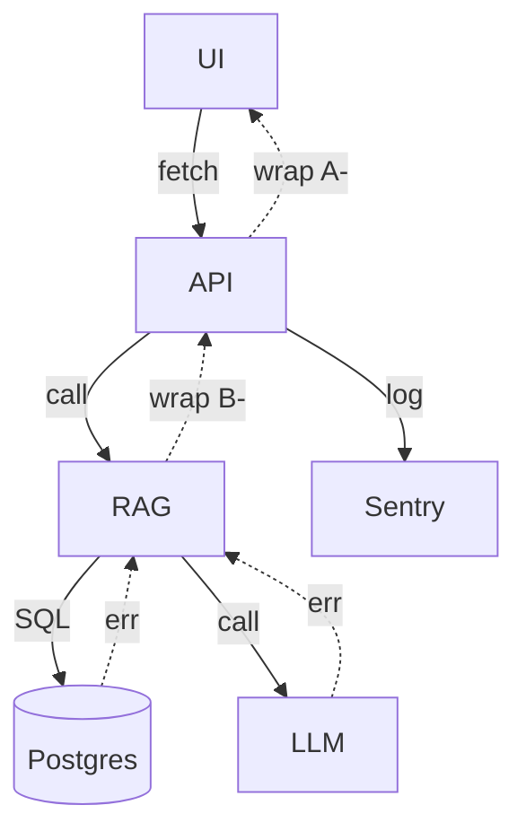

## 1. エラーモデル
| レイヤ | 例外クラス | HTTP Status | コード範囲 | ログレベル | ユーザー向けメッセージ |
|--------|-----------|-------------|-----------|-----------|----------------------|
| **UI** | `UiError` | 4xx | `U‑1xxx` | WARN | 画面上 Snackbar／Toast |
| **API** | `ApiError` | 4xx / 5xx | `A‑2xxx` | ERROR | JSON (see §4) |
| **Business (RAG)** | `RagError` | 5xx | `B‑3xxx` | ERROR | “再度お試しください”|
| **Infra** | `InfraError` | 5xx | `I‑4xxx` | FATAL | “現在サービスが混雑しています” |
| **External LLM** | `LlmError` | 502/504 | `E‑5xxx` | ERROR | “AI 応答が遅れています” |

> **原則**: 下位レイヤは上位レイヤの例外へ **ラッピング** し、最終的に API → UI へ変換する。

---
## 2. エラーコード一覧 (抜粋)
| Code | 意味 | 典型シナリオ | 対応策 (運用) |
|------|------|--------------|----------------|
| U‑1001 | 入力バリデーション失敗 | 空の質問 | クライアント側フォームガード |
| A‑2001 | 認証失敗 | JWT 期限切れ | 再ログイン誘導 |
| A‑2002 | 権限不足 | RBAC 拒否 | 管理者へ権限依頼案内 |
| B‑3001 | ベクトル検索 0 件 | 文書未登録 | FAQ 追加案内 |
| B‑3002 | LLM ハルシネーション検知 | コンテキスト不一致 | LLM 再呼び出し or Fallback |
| I‑4001 | DB コネクション枯渇 | 同時接続過多 | HPA & Pool サイズ調整 |
| E‑5001 | LLM Timeout | 5 s 超過 | Exponential Back‑off 3 回 |

---
## 3. API エラーレスポンス仕様
```jsonc
{
  "status": "fail",        // 固定値
  "code": "A‑2002",        // §3 参照
  "message": "権限がありません", // i18n 対応
  "info": {
    "traceId": "ab12…",   // 全レイヤ共通の TraceID
    "retryable": false,     // クライアント自動リトライ可否
    "ts": 1713682800        // epoch 秒
  }
}
```
* **traceId** は OpenTelemetry で自動採番。UI → API → LLM まで貫通。  
* **retryable** が true の場合、フロントは指数バックオフで最大 3 回再試行。  

---
## 4. ハンドリングフロー

1. **発生**: 下位レイヤで例外 throw。  
2. **ラップ**: 呼び出し元が独自 Error クラスに包む (`cause` 保持)。  
3. **マッピング**: API 層で `errorToHttp()` によってステータス／コード変換。  
4. **レスポンス**: フロントが `status === "fail"` を検知し UX へ通知。  
5. **ロギング**: Sentry に `traceId` + stacktrace を送信、重大度で PagerDuty。  

---
## 5. 再試行 & フォールバックポリシー
| タイプ | 範囲 | リトライ | バックオフ | フォールバック |
|--------|------|---------|-----------|----------------|
| **LLM Timeout** | LlmError | 3 回 | `1s * 2^n` | FAQ のみ回答 + 再試行案内 |
| **ネットワーク 5xx** | ApiError | 2 回 | 500 ms 固定 | “通信障害” メッセージ |
| **DB Deadlock** | InfraError | 1 回 | 100 ms | “再度質問してください” |

---
## 6. ログ & アラート連携
| イベント | ログ内容 (JSON key) | 送信ツール | アラート条件 |
|----------|---------------------|-------------|--------------|
| Error throw | `level:error`, `code`, `traceId`, `userId` | Sentry | env=prod & level≥error |
| LLM latency | `metric:llm_ms` | Datadog | p95 > 4000 ms 5 分 |
| DB error | `sql_state` | Vercel LogDrain | 5 回/1 min |

---
## 7. カスタマイズ手順 (概要)
| チェック | 影響ファイル | やること |
|----------|------------|-----------|
| **外部 API 追加** | `error_codes.ts` | 新しい `E‑5xxx` を追加し `wrapExternalError()` 実装 |
| **新モジュール** | `domainErrors.ts` | `M‑6xxx` 系を定義し API マッピングに組込 |
| **UI 文言変更** | `ErrorMessageMap.ts` | i18n key を更新 |

